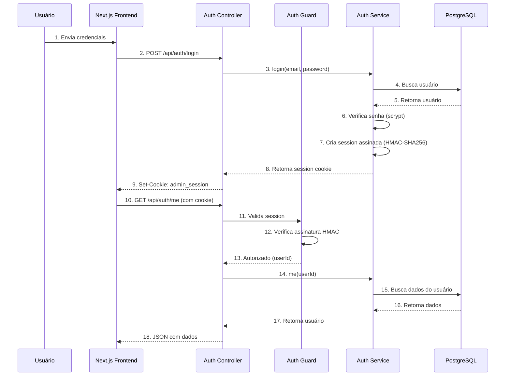
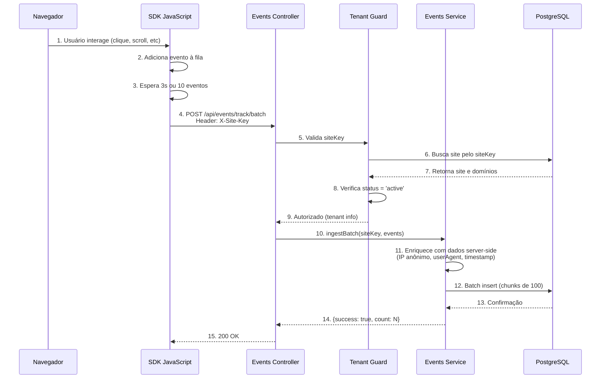
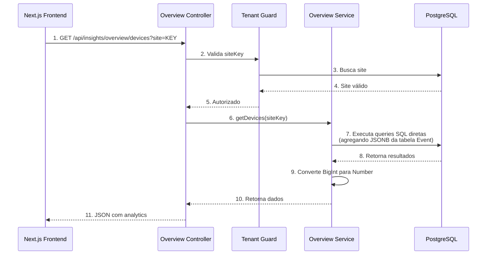
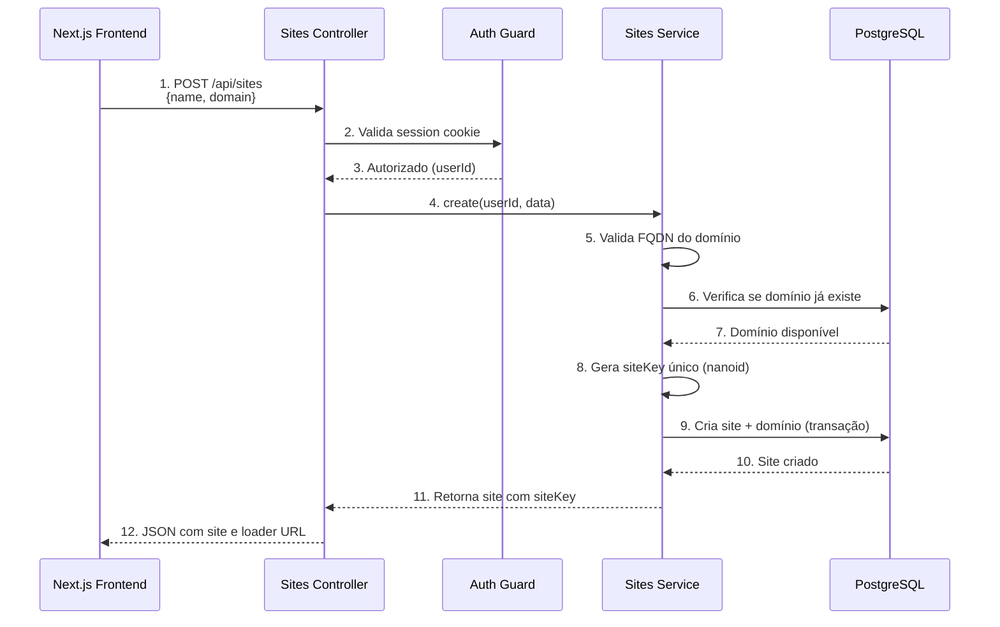

# Arquitetura do Sistema InsightHouse

## Visão Geral

O InsightHouse é uma plataforma de analytics web multi-tenant construída com NestJS, que permite rastreamento de eventos, análise de comportamento de usuários e geração de insights para sites imobiliários.

## Diagrama de Arquitetura

```mermaid
graph TB
    subgraph "Cliente Externo"
        Browser[Navegador do Usuário]
        SDK[SDK JavaScript]
    end

    subgraph "Frontend Admin"
        NextJS[Next.js App Router]
        ReactQuery[React Query Cache]
    end

    subgraph "Backend NestJS - Entry Point"
        Main[main.ts<br/>Bootstrap]
        AppModule[App Module<br/>Módulo Raiz]
    end

    subgraph "Middlewares Globais"
        Helmet[Helmet<br/>Security Headers]
        CORS[CORS<br/>Cross-Origin]
        Compression[Compression<br/>Gzip]
        CookieParser[Cookie Parser]
        ValidationPipe[Validation Pipe<br/>DTOs]
        Throttler[Rate Limiting<br/>100 req/min]
    end

    subgraph "Guards - Camada de Segurança"
        AuthGuard[AuthGuard<br/>Valida Session Cookie]
        TenantGuard[TenantGuard<br/>Valida Site Key]
    end

    subgraph "Interceptors"
        LoggingInterceptor[Logging Interceptor<br/>Request/Response Log]
    end

    subgraph "Controllers - Camada de Roteamento"
        AuthController[Auth Controller<br/>/api/auth/*]
        SitesController[Sites Controller<br/>/api/sites/*]
        EventsController[Events Controller<br/>/api/events/*]
        OverviewController[Overview Controller<br/>/api/insights/overview/*]
        SearchController[Search Controller<br/>/api/insights/search/*]
        PropertyController[Property Controller<br/>/api/insights/properties/*]
        ConversionController[Conversion Controller<br/>/api/insights/conversion/*]
        SdkController[SDK Controller<br/>/api/sdk/*]
        HealthController[Health Controller<br/>/api/health]
    end

    subgraph "Services - Camada de Negócio"
        AuthService[Auth Service<br/>Login, Register, Session]
        SitesService[Sites Service<br/>CRUD Sites & Domains]
        EventsService[Events Service<br/>Ingestão & Enriquecimento]
        OverviewService[Overview Service<br/>Queries SQL Diretas]
        SearchService[Search Service<br/>Queries SQL Diretas]
        PropertyService[Property Service<br/>Queries SQL Diretas]
        ConversionService[Conversion Service<br/>Queries SQL Diretas]
        SdkService[SDK Service<br/>Config & Loader]
        HealthService[Health Service<br/>Status Checks]
    end

    subgraph "Módulos Core"
        PrismaModule[Prisma Module<br/>Database Connection]
        ConfigModule[Config Module<br/>Environment Vars]
    end

    subgraph "Utils & Decorators"
        AuthUtils[Auth Utils<br/>Hash, Verify, Sign]
        SiteKeyUtils[Site Key Utils<br/>Generate, Validate]
        CurrentUserDec[CurrentUser<br/>Decorator]
        SiteKeyDec[SiteKey<br/>Decorator]
    end

    subgraph "Database"
        PostgreSQL[(PostgreSQL<br/>Events, Users, Sites)]
    end

    subgraph "Cache"
        MemoryCache[In-Memory LRU Cache<br/>TTL: 2 min]
    end

    %% Fluxos principais
    Browser -->|1. Carregar SDK| SDK
    SDK -->|2. Track Events| EventsController
    NextJS -->|3. API Calls| AuthController
    NextJS -->|4. API Calls| SitesController
    NextJS -->|5. API Calls| OverviewController
    NextJS -->|5. API Calls| SearchController
    NextJS -->|5. API Calls| PropertyController
    NextJS -->|5. API Calls| ConversionController

    %% Entry Point
    Main --> AppModule
    AppModule --> ConfigModule
    AppModule --> PrismaModule
    AppModule --> Throttler

    %% Middleware Flow
    EventsController -->|passa por| Helmet
    Helmet --> CORS
    CORS --> Compression
    Compression --> CookieParser
    CookieParser --> ValidationPipe
    ValidationPipe --> LoggingInterceptor

    %% Guard Flow
    AuthController -.->|protegido por| AuthGuard
    SitesController -.->|protegido por| AuthGuard
    EventsController -.->|protegido por| TenantGuard
    OverviewController -.->|protegido por| TenantGuard
    SearchController -.->|protegido por| TenantGuard
    PropertyController -.->|protegido por| TenantGuard
    ConversionController -.->|protegido por| TenantGuard

    %% Controller to Service
    AuthController --> AuthService
    SitesController --> SitesService
    EventsController --> EventsService
    OverviewController --> OverviewService
    SearchController --> SearchService
    PropertyController --> PropertyService
    ConversionController --> ConversionService
    SdkController --> SdkService
    HealthController --> HealthService

    %% Service to Database
    AuthService --> PrismaModule
    SitesService --> PrismaModule
    EventsService --> PrismaModule
    OverviewService --> PrismaModule
    SearchService --> PrismaModule
    PropertyService --> PrismaModule
    ConversionService --> PrismaModule
    SdkService --> PrismaModule
    HealthService --> PrismaModule

    %% Database Connection
    PrismaModule --> PostgreSQL

    %% Utils
    AuthService -.->|usa| AuthUtils
    SitesService -.->|usa| SiteKeyUtils
    AuthGuard -.->|usa| AuthUtils
    TenantGuard -.->|usa| PrismaModule

    %% Decorators
    AuthController -.->|usa| CurrentUserDec
    EventsController -.->|usa| SiteKeyDec

    style Main fill:#e1f5ff
    style AuthGuard fill:#ffe1e1
    style TenantGuard fill:#ffe1e1
    style PostgreSQL fill:#e1ffe1
    style MemoryCache fill:#fff3e1
```



## Fluxos de Dados Principais

### 1. Fluxo de Autenticação



### 2. Fluxo de Tracking de Eventos



### 3. Fluxo de Analytics (Insights)



### 4. Fluxo de Multi-Tenancy (Criação de Site)



## Módulos e Responsabilidades

### Módulos Core

| Módulo | Responsabilidade | Dependências |
|--------|-----------------|--------------|
| **AppModule** | Módulo raiz, orquestra todos os outros | Todos os módulos |
| **ConfigModule** | Gerencia variáveis de ambiente | Nenhuma |
| **PrismaModule** | Conexão singleton com PostgreSQL | ConfigModule |

### Módulos de Negócio

| Módulo | Responsabilidade | Dependências |
|--------|-----------------|--------------|
| **AuthModule** | Autenticação, registro, sessões | PrismaModule, ConfigModule |
| **SitesModule** | CRUD de sites e domínios, multi-tenancy | PrismaModule |
| **EventsModule** | Ingestão de eventos, enriquecimento | PrismaModule |
| **InsightsModule** | Analytics modular (overview, search, property, conversion), queries SQL diretas | PrismaModule |
| **SdkModule** | Servir SDK JavaScript e configurações | SitesModule |
| **HealthModule** | Health checks e monitoramento | PrismaModule |

### Guards (Segurança)

| Guard | Quando Aplica | O Que Faz |
|-------|---------------|-----------|
| **AuthGuard** | Rotas protegidas do admin | Valida session cookie HMAC-SHA256 |
| **TenantGuard** | Rotas multi-tenant (events, insights) | Valida siteKey e verifica status do site |

### Interceptors

| Interceptor | Função |
|-------------|--------|
| **LoggingInterceptor** | Loga todas as requests/responses com duração |

### Decorators Customizados

| Decorator | Função |
|-----------|--------|
| **@CurrentUser()** | Extrai `userId` da session no request |
| **@SiteKey()** | Extrai `siteKey` do tenant info no request |

## Camadas da Aplicação

```
┌─────────────────────────────────────────┐
│         Entry Point (main.ts)           │
│  - Bootstrap da aplicação               │
│  - Configuração de middlewares          │
│  - Swagger setup                        │
└─────────────────────────────────────────┘
                   ↓
┌─────────────────────────────────────────┐
│      Middlewares Globais                │
│  - Helmet (security headers)            │
│  - CORS (cross-origin)                  │
│  - Compression (gzip)                   │
│  - Cookie Parser                        │
│  - Validation Pipe (DTOs)               │
│  - Rate Limiting (throttler)            │
└─────────────────────────────────────────┘
                   ↓
┌─────────────────────────────────────────┐
│      Guards (Segurança)                 │
│  - AuthGuard: valida sessão             │
│  - TenantGuard: valida siteKey          │
└─────────────────────────────────────────┘
                   ↓
┌─────────────────────────────────────────┐
│      Interceptors                       │
│  - Logging: registra req/res            │
└─────────────────────────────────────────┘
                   ↓
┌─────────────────────────────────────────┐
│      Controllers (Rotas REST)           │
│  - Recebe requisições HTTP              │
│  - Valida DTOs                          │
│  - Chama services                       │
│  - Retorna respostas                    │
└─────────────────────────────────────────┘
                   ↓
┌─────────────────────────────────────────┐
│      Services (Lógica de Negócio)       │
│  - Processa dados                       │
│  - Aplica regras de negócio             │
│  - Interage com banco                   │
│  - Cache e otimizações                  │
└─────────────────────────────────────────┘
                   ↓
┌─────────────────────────────────────────┐
│      Prisma (ORM)                       │
│  - Type-safe database client            │
│  - Migrations                           │
│  - Query builder                        │
└─────────────────────────────────────────┘
                   ↓
┌─────────────────────────────────────────┐
│      PostgreSQL Database                │
│  - Users, Sites, Domains                │
│  - Events (JSONB para flexibilidade)    │
│  - Settings                             │
└─────────────────────────────────────────┘
```

## Segurança

### Autenticação
- **Método**: Session cookies assinados com HMAC-SHA256
- **Storage**: Cookie `admin_session` HttpOnly
- **Hashing**: Senhas com scrypt (Node.js built-in)
- **Validação**: Comparação constant-time (timingSafeEqual)

### Multi-Tenancy
- **Identificação**: Header `X-Site-Key` ou query param `site`
- **Validação**: TenantGuard verifica existência e status
- **Isolamento**: Todos os dados filtrados por `siteKey`

### Rate Limiting
- **Global**: 100 requests/minuto por IP
- **Events**: 1000 requests/minuto por siteKey

### Proteção de Dados
- **IP Anonymization**: Último octeto IPv4 zerado (LGPD/GDPR)
- **CORS**: Apenas origins autorizados
- **Helmet**: Security headers automáticos
- **Validation**: DTOs com class-validator

## Performance

### Cache
- **Tipo**: In-memory LRU
- **TTL**: 2 minutos para insights
- **Limpeza**: Automática quando > 1000 entradas

### Batch Processing
- **Events**: Aceita até 500 eventos por batch
- **Chunking**: Inserções em blocos de 100
- **Otimização**: Queries SQL paralelas (Promise.all)

### Database
- **Indexes**: Otimizados para queries frequentes
- **JSONB**: Busca eficiente em propriedades dinâmicas
- **Connection Pool**: Gerenciado automaticamente pelo Prisma

## Tecnologias

- **Framework**: NestJS 10.x
- **Language**: TypeScript 5.x (strict mode)
- **ORM**: Prisma 5.x
- **Database**: PostgreSQL 16
- **Validation**: class-validator + class-transformer
- **Documentation**: Swagger/OpenAPI 3.0
- **Security**: Helmet, CORS, Rate Limiting
- **Authentication**: Session cookies (HMAC-SHA256)
- **Password Hashing**: scrypt (Node.js built-in)

## Próximos Passos (Escalabilidade)

1. **Redis Cache**: Substituir in-memory por Redis distribuído
2. **Queue System**: Bull/BullMQ para processamento assíncrono de eventos
3. **Database Partitioning**: Particionar tabela Events por data
4. **Read Replicas**: Separar leitura (insights) de escrita (events)
5. **CDN**: Servir SDK JavaScript via CDN
6. **WebSockets**: Real-time analytics dashboard
7. **Aggregations**: Tabelas pré-calculadas para queries pesadas

